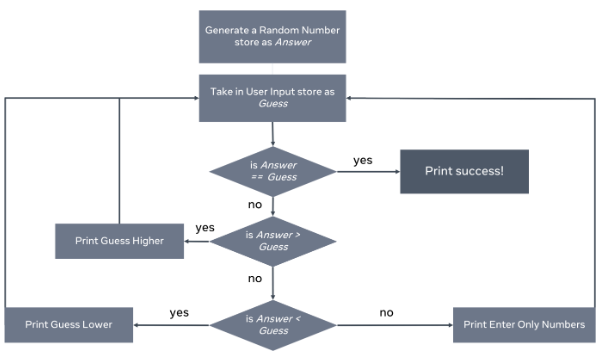
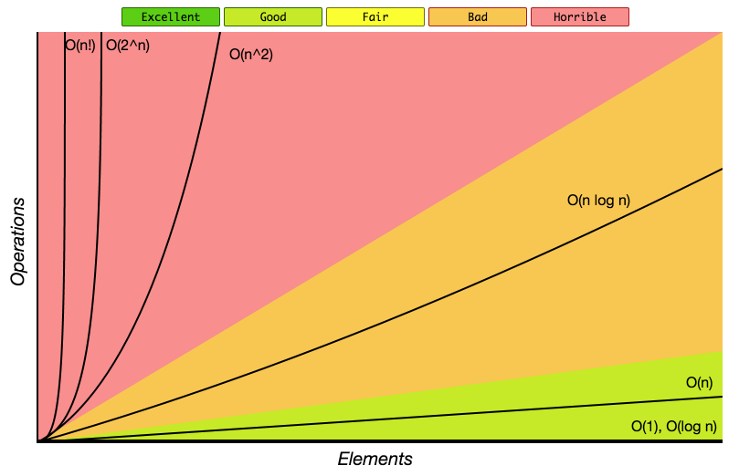
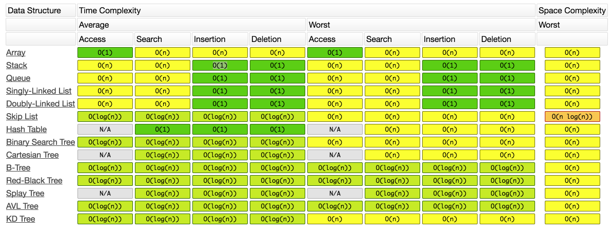

# CS Note

## Table of Contents
1. [Computer Memory and CPU Overview](#memory)
2. [Binary](#binary)
3. [Flow Chart](#flow_chart)
4. [Time & Space Complexity](#time&space_complexity)
5. [Data Structure](#data_structure)

---

## Computer Memory and CPU Overview

<b>(click to expand/hide)</b>

<!-- MarkdownTOC -->
  
### Introduction
- **Byte**: Consists of eight bits. 
- **Bit**: Simplest form of computing memory.
- **Memory Capacity**: Number of bytes a computer can hold.

### Central Processing Unit (CPU)
- Core of a computer.
- Processes both information and instructions.
- Works faster than the transfer of information.
- Switches tasks to allow info transfer to cache.

### Memory Types

#### Cache Memory
- Closest and fastest memory to the CPU.
- Most expensive type of memory.
- **Function**: When CPU gets an instruction, it checks cache first.
  - If info is in cache: it gets processed.
  - If not: CPU accesses main memory.
- Organized in zones: Zone 1 (most important) and subsequent zones (lesser importance).

#### Main Memory
1. **RAM (Read Access Memory)**:
   - Volatile: Info is lost when power is cut.
   - Holds data and instructions currently in use.
   - More RAM = Faster system due to improved transfer rate.
   
2. **ROM (Read Only Memory)**:
   - Non-volatile: Info retained when power is off.
   - Pre-programmed and cannot be altered.
   - Contains critical instructions/data, especially during startup.

#### Secondary Memory
- External memory solutions.
- Slower access compared to main and cache memory.
- Must transfer info to RAM for access.
- **Examples**: Cloud storage, external hard drives, memory sticks.

#### Resources
- Memory can be stored side-by-side or spread out throughout your computer. For some insights on this, you might be interested in reading more about [heap versus stack memory](https://courses.engr.illinois.edu/cs225/fa2022/resources/stack-heap/)

<!-- /MarkdownTOC -->

---

## Binary

<b>(click to expand/hide)</b>

<!-- MarkdownTOC -->

### Boolean logic
#### Truth Table

#### Gates

<!-- /MarkdownTOC -->

---

## Flow Chart

<b>(click to expand/hide)</b>

<!-- MarkdownTOC -->

#### flow chart example

<!-- /MarkdownTOC -->

---

## Time and Space Complexity

<b>(click to expand/hide)</b>

<!-- MarkdownTOC -->

### Time Complexity

### Space Complexity
space complexity = input space + auxiliary space

### Big-O notation (Time & space complexity)

#### Time & Space Complexity Table

#### Resources
- A discussion of [time and space costs](https://www.cs.utexas.edu/users/djimenez/utsa/cs1723/lecture2.html) and plus some helpful examples
- A Scaler Topics article about [space complexity](https://www.scaler.com/topics/data-structures/space-complexity-in-data-structure/)

<!-- /MarkdownTOC -->

---

## Data Structure

<b>(click to expand/hide)</b>

<!-- MarkdownTOC -->

### -

#### Resources
- This [Array basics](https://www.cs.fsu.edu/~myers/c++/notes/arrays.html) article provides an excellent write-up on arrays and how they are initialized and used. 
- This article called [Immutable data structures in F#](https://www.compositional-it.com/news-blog/immutable-data-structures-in-f/) provides an analysis of mutable versus immutable data structures:
- This article about [First-class objects](https://isaaccomputerscience.org/concepts/prog_func_first_class_objects?examBoard=all&stage=all) outlines what a first-class object is

<!-- /MarkdownTOC -->

---
